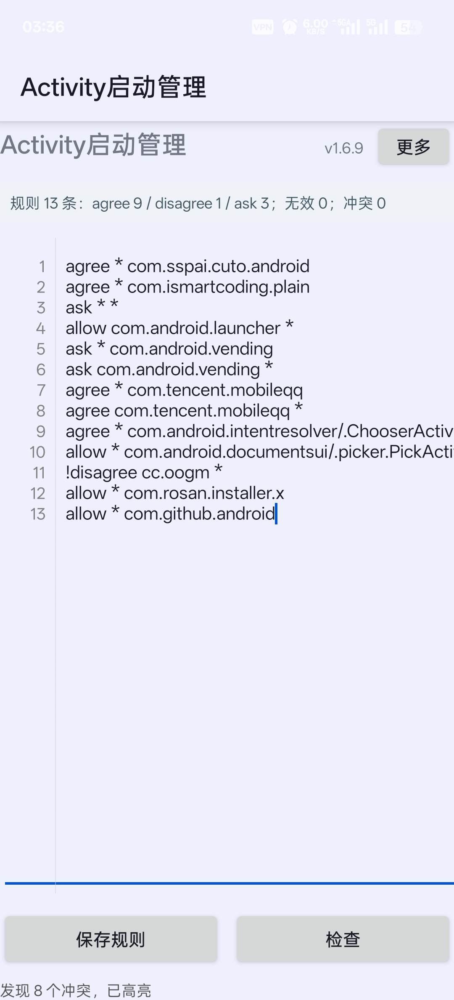
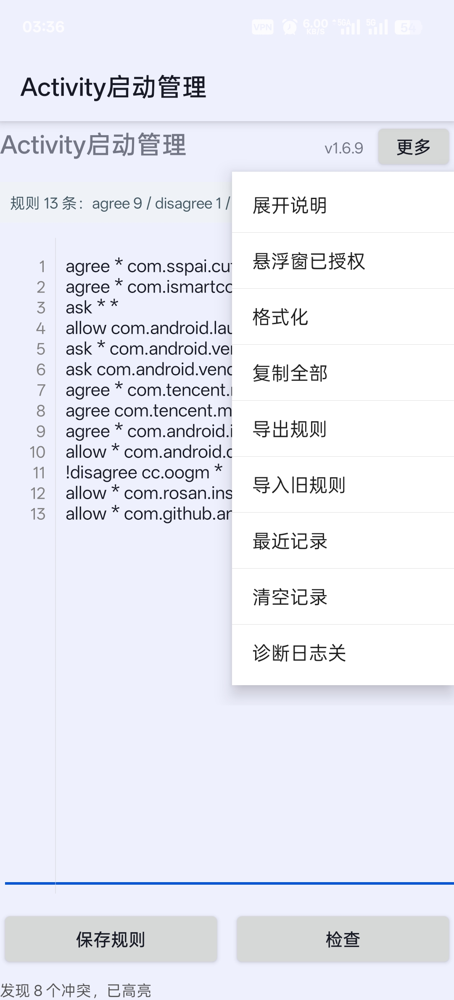
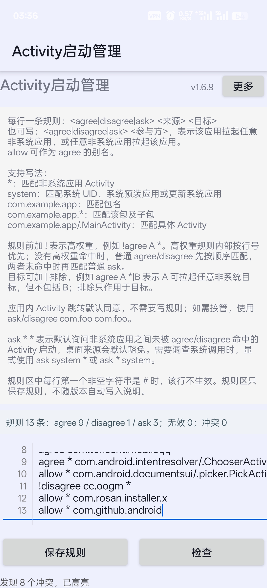

# Activity启动管理

`Activity启动管理` 是一个 LSPosed 模块，用于在系统框架层按规则管理 Android Activity 之间的启动行为。

当前支持三类规则：

- `agree`：允许来源 Activity 启动目标 Activity。
- `disagree`：拒绝来源 Activity 启动目标 Activity。
- `ask`：在未被 `agree/disagree` 命中时弹出底部悬浮窗，允许用户本次同意或拒绝。

`allow` 可作为 `agree` 的别名。

## 基本信息

- 应用名：`Activity启动管理`
- 包名：`t8numen.activitystartmanager`
- 当前版本：`1.7.1`
- Xposed Modules Repo Release tag：`42-1.7.1`
- 推荐环境：LSPosed 1.9.2、已 Root 设备
- 已测试环境：ColorOS / Android 15

## LSPosed 作用域

模块声明的作用域：

- `android`
- `com.oplus.securitypermission`
- `com.coloros.securitypermission`
- `com.android.permissioncontroller`

`android` 用于 hook 系统框架 Activity 启动链路；权限管理器相关包用于尽量绕过 ColorOS / OPlus 的二次拉起确认弹窗。

## 权限说明

- `SYSTEM_ALERT_WINDOW`：用于显示 `ask` 规则命中后的底部悬浮询问窗。
- `QUERY_ALL_PACKAGES`：用于读取来源/目标应用名称和图标，便于在询问窗与记录中展示。

模块不主动联网，规则和最近记录保存在本地。

## 界面展示

以下截图来自 `1.6.9`：

<table>
  <tr>
    <td align="center"><br>主页与规则区</td>
    <td align="center"><br>右上角更多菜单</td>
  </tr>
  <tr>
    <td align="center"><br>规则说明展开</td>
    <td align="center"><br>ask 询问悬浮窗</td>
  </tr>
</table>

## 项目定位与参考

本项目的目标是做一个可审计、可修改、可长期维护的开源 Activity 启动规则管理模块。

开发过程中参考过 [Activity链式启动管理器](https://github.com/Xposed-Modules-Repo/com.alphi.activitystartmanager) 的部分产品思路，例如跨应用启动询问、允许/拒绝规则、启动记录辅助编写规则等。该仓库的公开页面当前主要提供 `README.md` 和 `SUMMARY`，未看到可直接审计和修改的 Android 源码目录；因此本项目选择重新实现，并以 `GPL-3.0-only` 开源。

对比仅基于双方公开 README 和本项目源码，不评价对方未公开实现：

| 维度 | 本项目 | Activity链式启动管理器 |
| --- | --- | --- |
| 开源状态 | 完整源码开源，采用 `GPL-3.0-only` | Xposed Modules Repo 仓库当前未展示 Android 源码目录 |
| 基础规则 | `agree` / `disagree` / `ask`，`allow` 作为 `agree` 别名 | `allow` / `ask` / `deny` |
| 系统应用 | `*` 默认只匹配非系统应用，系统调用需显式使用 `system` | 公开 README 中说明自定义规则暂不支持配置系统应用 |
| 规则增强 | 支持 `!` 高权重、目标排除 `A *|B`、两段式参与方规则 `agree A` | 公开 README 中提到高级规则、后台启动拦截和日志记录器 |
| 交互重点 | 规则区行号、检查/冲突高亮、底部 ask 悬浮窗、长按复制规则可用 Activity | 启动对话框、规则模板、日志记录器辅助复制规则 |

## 规则格式

每行一条规则：

```text
<agree|disagree|ask> <来源> <目标>
<agree|disagree|ask> <参与方>
```

支持写法：

- `*`：匹配非系统应用 Activity。
- `system`：匹配系统 UID、系统预装应用或更新系统应用。
- `com.example.app`：匹配包名。
- `com.example.app.*`：匹配该包及子包。
- `com.example.app/.MainActivity`：匹配具体 Activity。

示例：

```text
agree * com.android.intentresolver/.ChooserActivityLauncher
allow * com.android.documentsui/.picker.PickActivity
agree * com.sspai.cuto.android
ask bin.mt.plus com.openai.chatgpt
agree com.tencent.mobileqq
ask * org.videolan.vlc
ask * *
ask system *
ask * system
!agree com.source.app *|com.blocked.app
```

## 执行顺序

规则前加 `!` 表示高权重，例如：

```text
!agree com.source.app *
!ask * com.target.app
```

高权重规则先按行号匹配，`agree`、`disagree` 和 `ask` 都可使用。普通规则仍保持兼容逻辑：先按顺序匹配 `agree/disagree`，两者都未命中时再按顺序匹配 `ask`。

目标可加 `|` 排除，排除只作用于目标：

```text
!agree com.source.app *|com.blocked.app
```

含义是 `com.source.app` 可拉起任意非系统目标，但不包括 `com.blocked.app`。

两段式参与方规则用于简化“来源或目标包含该应用”的规则：

```text
agree com.example.app
disagree com.example.app
ask com.example.app
```

含义是该应用拉起任意非系统应用，或任意非系统应用拉起该应用。系统应用仍需显式使用 `system`。

应用内 Activity 跳转默认同意，不需要写规则；如果需要接管应用内跳转，可显式添加：

```text
ask com.example.app com.example.app
disagree com.example.app com.example.app
```

## 风险与恢复

这是系统框架层模块，错误规则可能影响应用正常打开。公开使用前建议保留以下基础放行规则：

```text
allow com.android.launcher *
agree * com.android.intentresolver/.ChooserActivityLauncher
allow * com.android.documentsui/.picker.PickActivity
```

如果误配规则导致无法正常使用：

1. 在 LSPosed 中禁用模块。
2. 重启手机或重启作用域进程。
3. 打开模块应用修改规则。

如果系统权限管理器弹窗仍优先出现，可先在系统弹窗中选择永远允许，再交给模块规则管理。

## 构建

调试构建：

```powershell
$env:GRADLE_USER_HOME = (Join-Path (Get-Location) '.gradle-local')
.\gradlew.bat :activitystartmanager:testDebugUnitTest :activitystartmanager:assembleDebug
```

发布构建：

```powershell
$env:GRADLE_USER_HOME = (Join-Path (Get-Location) '.gradle-local')
.\gradlew.bat :activitystartmanager:testDebugUnitTest :activitystartmanager:assembleRelease
```

发布签名配置读取仓库根目录的 `release-signing.properties`，该文件和本地 keystore 不应提交到 Git。

## 发布

Xposed Modules Repo 要求：

- GitHub 仓库名：`t8numen.activitystartmanager`
- 仓库描述：`Activity启动管理`
- Release tag：`42-1.7.1`
- Release 资产：上传 release APK
- 仓库根目录保留 `SUMMARY` 和 `README.md`

提交入口：

- https://modules.lsposed.org/submission/
- https://github.com/Xposed-Modules-Repo/submission

更多发布步骤见：

- `docs/release-checklist.md`
- `docs/release-assets.md`
- `docs/xposed-modules-repo-submission.md`

## 许可证

本项目采用 `GPL-3.0-only` 许可证，详见 [LICENSE](LICENSE)。

## 致谢

本项目早期构建和开发参考了 [MagicianGuo/Android-XposedTest](https://github.com/MagicianGuo/Android-XposedTest) 的项目结构和 Xposed 模块示例思路，感谢原作者提供的学习参考。
